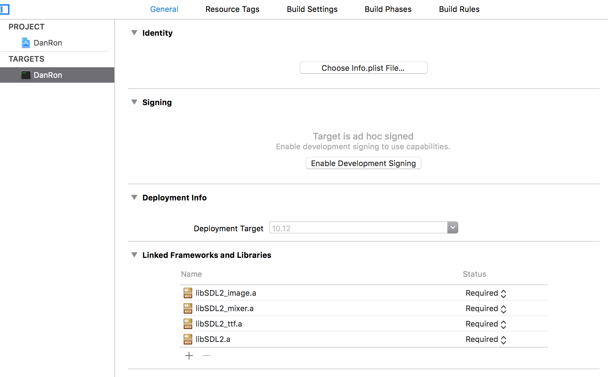
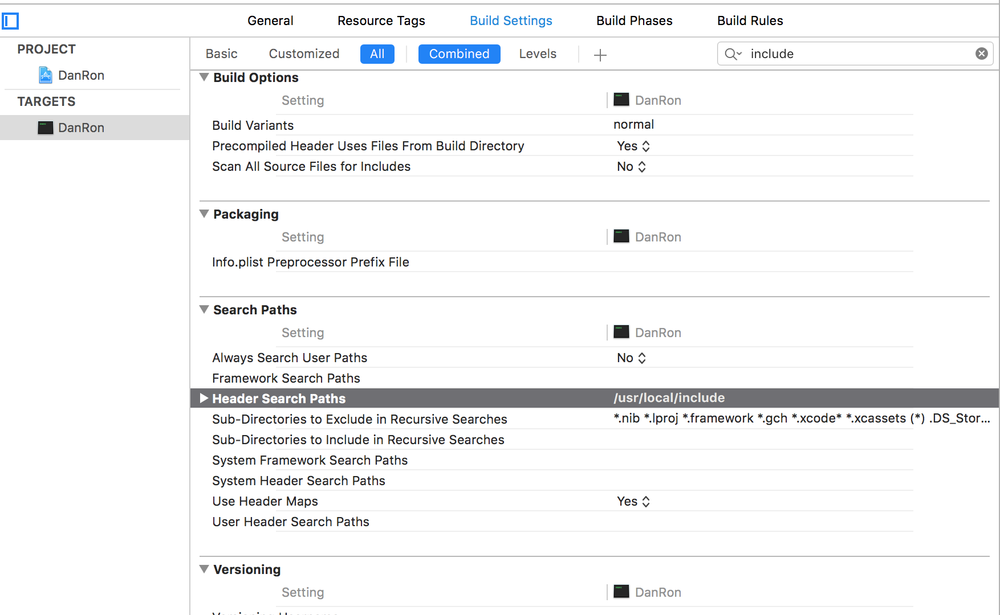

## ReTro-DanganRonpa
レトロゲーム風ダンガンロンパ For MacOS(製作中)
一部ゲーム機能

### 必要なもの
以下に示すライブラリを導入してください。
- SDL2
 - https://www.libsdl.org/download-2.0.php
- SDL2_ttf
 - https://www.libsdl.org/projects/SDL_ttf/
- SDL2_image
 - https://www.libsdl.org/projects/SDL_image/
- SDL2_mixer
 - https://www.libsdl.org/projects/SDL_mixer/

### キッティング
1. 項目「必要なもの」に示しているライブラリ群をインストールしてください。
1. [Xcode](https://blog.codecamp.jp/xcode_install )をインストールしてください。
1. DanRon.xcodeprojをXcodeから開き、左側のファイル一覧から一番上のDanRonという項目を開いてください。

  
1. Targetsの中にあるDanRonを選択して、General -> Linked FrameWorks and Librariesに
  - SDL2.a
  - SDL2_ttf.a
  - SDL2_image.a
  - SDL2_mixer.a

  を追加してください。
  
1. Build Settings -> Search Paths -> Header Search Pathsに、SDL関係のヘッダーファイルが入っているディレクトリのパスを入れてください。
  

1. 左上の三角形のボタンでコンパイルとビルドができます。

### スクリーンショット
